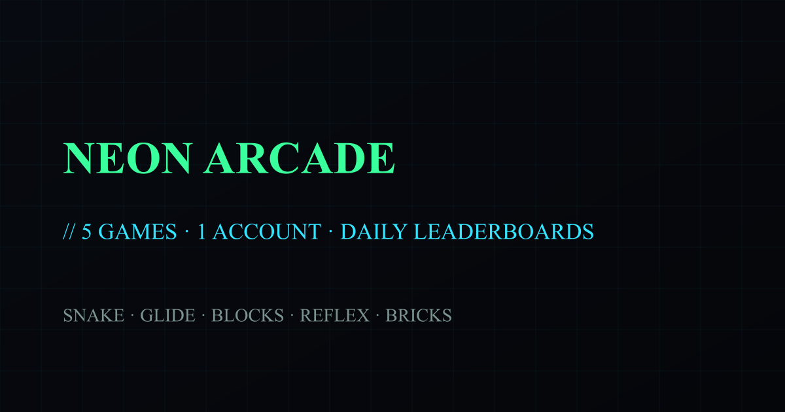

# Neon Arcade



Five free browser games, one account, per-game daily leaderboards, and top-3
celebrations — all in a synthwave terminal aesthetic.

| Game | Hook |
| --- | --- |
| **Snake** | the classic, with progressive speed |
| **Glide** | one-tap flappy — thread the gaps |
| **Blocks** | 2048-style merge puzzle |
| **Reflex** | stop the marker in a shrinking zone |
| **Bricks** | one-ball, one-life breakout |

## Architecture

- **Next.js 16 App Router** — hub at `/`, each game at `/<slug>`
- **Game registry** (`src/lib/games.ts`) — single source of truth; adding a
  game is one registry entry + one component + one thin page
- **Shared shell** (`GamePage.tsx`) — auth, run tokens, submission,
  leaderboard, and celebrations are implemented once; games only implement
  the `GameProps` contract
- **Upstash Redis** — accounts (scrypt-hashed passwords, hashed session
  tokens), per-game daily leaderboards (`arcade:lb:<game>:<day>`), and
  single-use run tokens bound to account + game
- **Anti-cheat** — per-game max-plausible-score and min-ms-per-point rules
  enforced server-side against the token's server-recorded start time
- Accounts are shared with [Snake Arcade](https://playsnakearcade.vercel.app)
  (same Redis user namespace) — one signup works on both sites

## Setup

```bash
npm install
cp .env.example .env.local   # Upstash Redis credentials
npm run dev
```

Regenerate branding/celebration assets with
`node scripts/generate-assets.mjs` and
`node scripts/generate-celebrations.mjs`.
